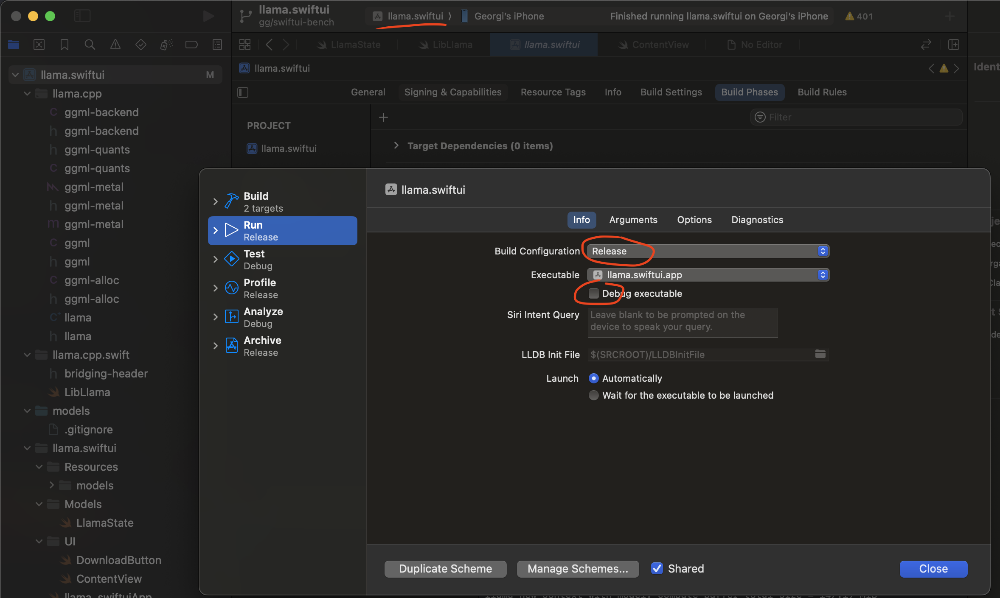
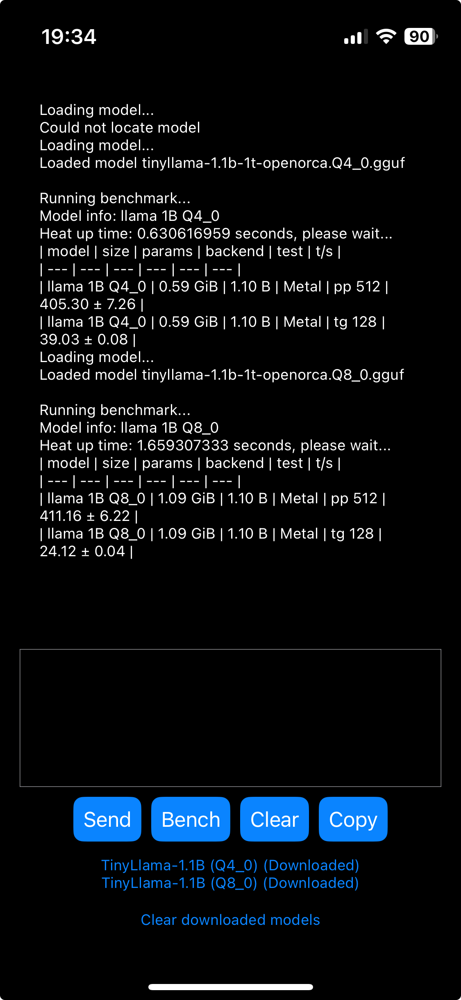

## iOS Benchmark Instruction

-   Clone the project

```
git clone https://github.com/liro-hinus/llama.cpp
```

-   Open the `examples/llama.swiftui` with Xcode
-   Enable Automatic signing and change bundle identifier to something unique, eg `com.vuonghoainam.llama-swift`
-   Enable Release build
    
-   Deploy on your iPhone / iPad, connect to your real device with a cable and do all the trusting stuff required by Apple, including trusting the developer certificate in iOS settings.
-   Build and run the app, it should now appear on your device
-   Stop Xcode, manually close the app then run the app from the device. This is important because the performance when running through Xcode is significantly slower
-   Download the models and run the "Bench" for each one
    
-   Running the "Bench" a second time for the same model can give more accurate results
-   With each new model, you should close the app entirely and run it again
-   Click "Copy" to copy the run log to the clipboard, paste it into your mac and save it as a text file with `.log` extension, file name should contain the model name and device name, e.g. `tiny_llama_ipad_pro_11.log`

## Create comparison table

-   Run `scripts/extract_metric.py` to generate the comparison table across all test run:

```
usage: extract_metric.py [-h] [--run_log_dir RUN_LOG_DIR]

options:
  -h, --help            show this help message and exit
  --run_log_dir RUN_LOG_DIR
                        Path to all the run log file.
```
